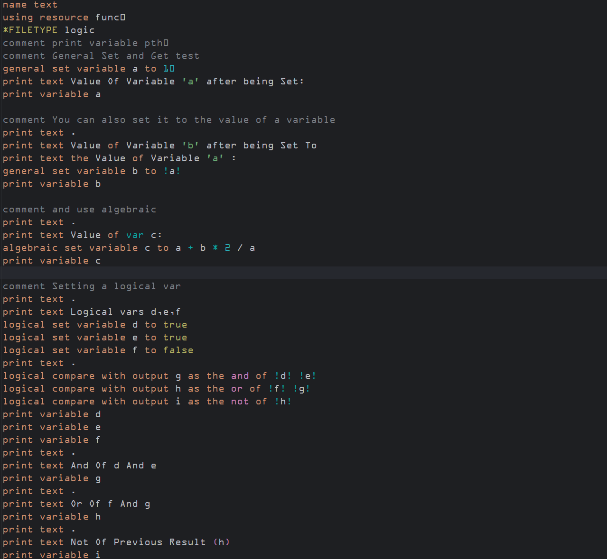
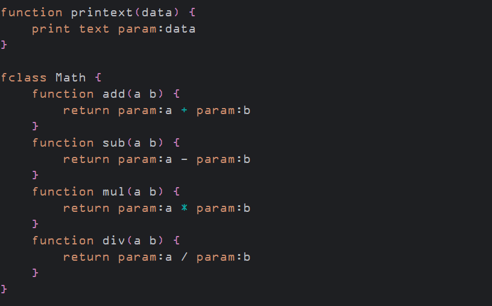

# LogicLang

The simple logical language

---

## Overview

---

## Table of Contents

<!-- TOC -->
* [LogicLang](#logiclang)
  * [Overview](#overview)
  * [Table of Contents](#table-of-contents)
  * [Description](#description)
  * [Features](#features)
  * [Setup and Usage](#setup-and-usage)
  * [Limitations](#limitations)
  * [Planned Updates](#planned-updates)
  * [Screenshots](#screenshots)
  * [Syntax](#syntax)
    * [Environment](#environment)
    * [Comments](#comments)
    * [Printing and Variables](#printing-and-variables)
      * [Other set types](#other-set-types)
    * [Comparisons](#comparisons)
    * [If statements](#if-statements)
    * [For loops](#for-loops)
    * [Functions](#functions)
      * [Definition](#definition)
      * [Argument Access](#argument-access)
      * [Returns](#returns)
    * [Classes](#classes)
    * [Type Definitions](#type-definitions)
    * [Input Processing](#input-processing)
<!-- TOC -->

---

## Description

`LogicLang` is an attempt of making a language closer to being human readable than 
machine readable. It is still constantly being updated. 

---

## Features

---

## Setup and Usage

You must have Python 3.9.0 or later installed. (Python 3.12 recommended)

Drag any `.logical` file onto `interpreter.py` and it will be run.

you can also use `python interpreter.py <file_path> <options>`

If you want to have a quick way to run on windows, you can create a batch file to run the interpreter

```batchfile
@echo off
set installDirectory=C:/Your_Install_Directory
C:/Windows/py.exe %installDirectory%/loglang/interpreter.py %1
pause>nul
```

Then right click on a file type, select 'Open With..', select the batch file, and click 'Always'

For Linux:

```bash
#!/bin/bash

installDirectory="$HOME/loglang"
python3 "$installDirectory/interpreter.py" "$1"
read -p "Press Enter to continue..."
```

---

## Limitations

---

## Planned Updates

| Item                      | NS / IP / C * | Planned Release Update |
|:--------------------------|:-------------:|-----------------------:|
| Functions and Classes     |       C       |                   8a20 |
| Advanced Functions        |      IP       |                   9a10 |
| Arrays Fully Working      |       C       |                   8a30 |
| Sets, Tuples, other types |      NS       |                   8a40 |
| Multithreading, etc.      |      NS       |           10a or later |
| Type Definitions          |      IP       |           10a or later |
| Input Processing          |      NS       |                   9a40 |

*Not Started / In Progress / Completed

```
            0a00c0
            ^ ^  ^
 Major update |  |
              |  |
   Minor update  |
                 |
    Minor change/fix
           (commit)
```

---

## Screenshots





---

## Syntax

For the logic filetype of LogicLang, syntax is pretty simple

### Environment

To start, we need to define a few things:

* We will begin the file with `name`, which will set the window title and the reference
* We will also set `*FILETYPE` to 'logic' (compound will be used later)

```
name hello_world
*FILETYPE logic
```

### Comments

You can write a comment by using comment at the end or beginning of a line

`
comment This is a comment
`

### Printing and Variables

IF you want to print, you can use `print text`

```
print text Hello World
```

AS OF 8a32:

`print text` requires the text to be a quoted string: `print text "hello world"`

To assign variables, we will use `general set`, which will
be used when we don't know what type something is.

To get a variable, you surround the name of the variable with exclamation marks

Print comes with its own method of printing variables, so those wont be needed there.

Here's an example:

```
general set variable a to 10
general set variable b to !a!
print variable b
```

**IF you want to include spaces, you must use \x20**


#### Other set types

there are other set types for other applications that include:

* `logical set`
* `algebraic set`

Logical set is used to set a variable to a boolean value:

`logical set variable selected to true`

Algebraic set is used to resolve an equation to set a variable

`algebraic set variable result to 2 * x + y - 3`

### Comparisons

Comparisons can be used to execute locigal operations, such as and, or, not

```
logical compare with output result as the and of !a! !b!
print variable result
```

### If statements

You can use if statements to make a comparison, and the format is pretty simple

`if variable a is (greater|less|equal) than variable a then { ... }`

If statements also support more compairisons

`if !b! < !a! then { print text "!a! is greater than !b!" }`

### For loops

For loops are similar to loops in other languages

`for i from 1 to 10 then ...`

There is also an option to loop from am array

`for item in list then ...`

### Functions

Functions are where it starts to get complicated.

* **Functions are ONLY available in compound mode**

#### Definition

To define a function, you type:
`function HelloWorld(argument text){}`
Arguments are seperated by spaces, so be careful when naming them.
The body of the function will be inside the curly brackets `{}`

#### Argument Access

To get the value of an argument of a function from inside
a function, you must use `param:` before the variable name.

```
function printext(data) {
    print text param:data
}
```

#### Returns

To return a value from a function, use `return`, and to acess it,
use `!result!` immediately after the function execution.

```
function add(a b) {
    return param:a + param:b
}
add(10 5)
print variable result
```

### Classes

Classes are very simple and can be declared by using `fclass`
To call a function from a class, use `class.function()`

```
fclass Math {
    function add(a b) {
        return param:a + param:b
    }
    function sub(a b) {
        return param:a - param:b
    }
    function mul(a b) {
        return param:a * param:b
    }
    function div(a b) {
        return param:a / param:b
    }
}

Math.add(10 5)
print variable result
Math.mul(10 5)
print variable result
```

### Type Definitions

Type definitions are not complete yet and are very complicated

<!--
The currently is not much documentation on this topic and it is in progress.
Here is a sample to show you what they currently loook like, which will most likely be final.
-->

The syntax of a type definition is `type <type> (pattern)`

For patterns, you start with `matches` to define what the type must match. 
Ex: `matches <pattern> <defs>`. 
You can also use `matches` to check through an array or `varInt`. Ex:`type data (matches any in textarray)` 

Here is a snippet of the definitions in the `asm` resource
```
comment Type definitions
type hex (matches any in hexbytes with any len)
type text (matches any in textbytes with any len)
type word (matches *reg "\w+" with len equal 4)
type chars (matches *reg "\w+" with any len)
type char (matches *reg "\w+" with len equal 1)

type float (matches 0..9.0..9)
type integer (matches 0..9 with len greater equal 1)
type precision (matches *reg "([0-9]*).([0-9]*))" with len greater 2)

type array (matches *v *reg any "\w+_[0-9]+" with any len)
type tuple (matches (*, *) where * any with any len)

type refdict (matches r[*][*], z[*][*] as series with any len)
type keydict (matches {"*key", "*value"} any where both *\w+ any with any len) comment might need improvement

type zset (matches *("*", *) where * any with len 2)

type bytes (matches None) comment Not Yet Implemented
type bytearray (matches None) comment Not Yet Implemented
type memory (matches None) comment Get address of byte in memory

type NoneType (matches None)

type object (matches <*> where * any with any len) comment Not Yet Implemented
```

### Input Processing

```
input <variable> <prompt>
```

Input will set the variable to what is inputted, with an optional prompt.

** As of now, if you use `asm` or are using a compound filetype, it will ask for an 
input during compile. Just hit enter to continue past, and your desired input will 
work during the code execution (it will ask you again).


### Entrypoints and Reruns
**These functions are still in development**


#### Entrypoint

`run` or `run <line>`

#### Rerun

A rerun will restart the execution of the current program, pulling from `rt_temp.ltmp` and `temp.pairs`
A rerun will also use the same RTID, so RTID-based randomization will not work 

Usage:
`rerun`


### Pulling from python

To get a variable or function, use the `py:` prefix

To got the RTID use:

`general set rtid to py:rtid`


List of functions and variables:


| Name          | Type    | Python Equivalent  |
|:--------------|:--------|:-------------------|
| `rtid`        | var     | `rtid`             |
| `self`        | cls     | `self`             |
| `linecount`   | var     | `self.linecount`   |
| `vars`        | list    | `self.vars`        |
| `sys`         | mod     | `sys`              |
| `os`          | mod     | `os`               |
| `printmods`   | mod     | `printmods`        |
| `util`        | mod     | `psutil`           |
| `chr`         | func    | `chr()`            |
| `ord`         | func    | `ord()`            |
| `bin`         | func    | `bin()`            |
| `hex`         | func    | `hex()`            |
| `MVAR`        | funcval | `vars(math)`       |


```python
self.python_context = {
            "MVAR": vars(math),
            "__builtins__": __builtins__,
            "rtid": rtid,
            "linecount": self.linecount,
            "vars": self.vars,
            "sys": sys,
            "os": os,
            "printmods": printmods,
            "util": psutil,
            "chr": chr,
            "ord": ord,
            "self": self,
            "bin": bin,
            "hex": hex
        }
```


- [x] one
- [ ] two
- [x] three

<footer>
  <p> &copy;  N<sup>12</sup> 2025 </p>
</footer>
